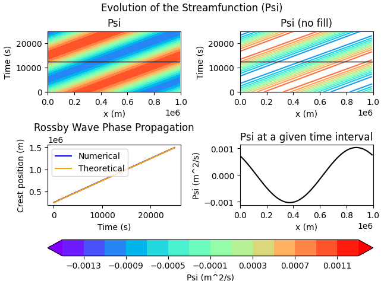

# Example

This file provides a quick example of the model output using values that differ from the default values and also provides some future ideas.

## Output

The image below was run with the following parameters:

k = 2 $\pi$ / lx 

nx = 128

lx = 1e6  

nt = 500

dt = 50

u = 50 

beta = 1.14e-11 

e = 0.001 

omega = 1.5

tol = 1e-10

t_index = 250

Further output:

-Proper time step check (<1): 0.32

-Initial vorticity error = 7.927e-18

-Theoretical phase speed = 49.7112 m/s

-Numerical phase speed = 49.6897 m/s

The black line shows the selected "t_index" parameter. In this run, "t_index" was set to 250 (scaling factor of 100 via the y-axis output). The bottom-right figure shows the streamfunction vs. the distance for that given "t_index" time selected. The numerical and theoretical Rossby Wave phase speed evolutions are in good agreement and there is noticeable tilit in the streamfunction evolution.

## Ideas for Future Runs
1. Explore the role that $\beta$ and the zonal velocity component, u, have on the system and model output. Examine if there is a relationship between the two parameters themselves.
2. Explore the effects that the amplitude value, e, has on the system behavior and model output.
3. Expand the analysis to a 2D representation with a y-coordinate.
4. Explore the effects of changing the wavenumber value under "model constants."
   - For example, changing it from 2 $\pi$ to 4 $\pi$ would add more wavelengths across the domain, which could potentially cause issues       in how the numerical phase speed is determined, as the crest tracking method would have to be modified.
