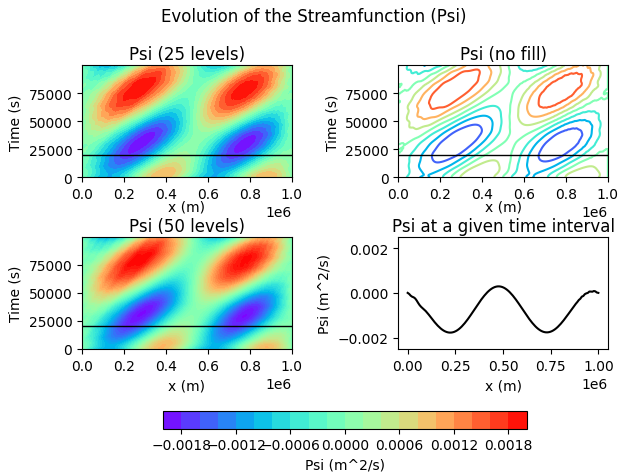

This file provides a quick example of the model output as well as some future ideas.

## Output

The image below was run with the following parameters:

nx = 128

lx = 1e6 m

nt = 1000

dt = 100

u = 5 m/s

beta = 1.62 * (10 ** -11) /ms

e = 0.001 

k = 4 * np.pi / lx 

omega = 1.5

tol = 1e-6

The black line shows the selected "t_index" parameter. In this run, "t_index" was set to 200 (scaling factor of 100 via the y-axis output). The bottom-right figure shows the streamfunction vs. the distance for that given "t_index" time selected.

## Ideas for Future Runs
1. Explore the role that $\beta$ and the zonal velocity component, u, have on the system and model output. Examine if there is a relationship between the two parameters themselves.
2. Explore the effects that the amplitude value, e, has on the system behavior and model output.
3. Expand the analysis to a 2D representation with a y-coordinate.
