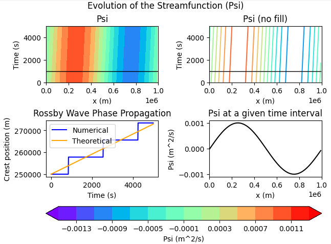

# 1D Barotropic QG Model

# Overview

The code in this repository is a simple 1D Barotropic Quasi-Geostrophic model that tracks Rossby Wave propagation.  The goal of this model was to create a simple, easy-to-use code to examine Rossby Wave propagation. The fundamental equation utilized in this model is the 1D potential vorticity conservation equation:

$$
\frac{\partial q}{\partial t} + u \frac{\partial q}{\partial x} + \beta \frac{\partial \psi}{\partial x} = 0      
$$

where q is the potential vorticity, u is the zonal velocity component, β is the planetary vorticity gradient, and ψ is the streamfunction, which is related to the potential vorticity via:

$$
q = \nabla^2 \psi 
$$

# Numerical Methods

The model utilizes a finite difference grid scheme as well as a Successive Over-Relaxation (SOR) method to iteratively solve the Poisson equation relating the streamfunction and the vorticity (see the file: “Successive_Over-Relaxation_Method.md” for details). The model also contains periodic boundary conditions and utilizes a forward Euler time step. 

# Running the Model

All constants are listed at the beginning of the script (“1D_Barotropic_Model_CODE.py”) as well as below, and the output produces a four-panel plot that includes the following:

1. Top-left: the streamfunction evolution (filled) 
2. Top-right: the streamfunction evolution with contours only
3. Bottom-left: the numerical phase speed propagation and the theoretical phase speed propagation
4. Bottom-right: the streamfunction at a given time step (ψ vs. x)

The model also returns:
1. A time check value to ensure the forward Euler time-stepping scheme is appropriate for the chosen model parameters (value should be <1; however, note that this is not a complete stability test)
2. The initial vorticity error comparing the numerical value obtained to the theoretical value obtained
3. The theoretical phase speed
4. The numerical phase speed

The top-left and top-right plots contain an overlaid black line, which is an indicator of the selected time step (the “t_index” variable). This overlaid black line is what is displayed on the bottom-right panel that plots the streamfunction vs. the horizontal distance. The bottom-left plot shows the numerical phase speed propagation that was obtained from the model and the computed theoretical phase speed. The numerical phase speed is found by examining the crest points. An example output is shown in the file “Example_Output.md"
and the default model output is shown below.

# Model Input

### Model Constants

nx -> number of spatial grid points 

lx -> domain length (m)

k = 4 * np.pi / lx -> wavenumber

### Model Parameters

nt -> number of time steps (DEFAULT: 500)

dt -> time step (s) (DEFAULT: 10)

u -> zonal velocity component (m/s) (DEFAULT: 5)

$\beta$ (beta) -> planetary vorticity gradient (/ms) (DEFAULT: 1.62e-11)

e -> initial disturbance amplitude (DEFAULT: 0.001)

$\omega$ (omega)  -> SOR relaxation factor (DEFAULT: 1.5)

$\epsilon$ (tol) -> SOR convergence tolerance (DEFAULT: 1e-10)

time index (t_index) (DEFAULT: 100)

# Output Example

The returned values are:
- Proper time step check (<1): 0.0064
- Initial vorticity error = 7.927e-18
- Theoretical phase speed = 4.5896 m/s
- Numerical phase speed = 4.8610 m/s

The model reproduces the expected propagation of a barotropic Rossby Wave. The output figure above shows the evolution of the streamfunction throughout the model run and the corresponding spatial structure at a selected time step (here, t_index = 100). The plot also shows the computed numerical and theoretical phase speeds. The example plot above was done for the default model conditions/parameters. See the file "Example_Output.md" for an example using different parameter values as well as analysis ideas.

# Packages

The only packages needed to run this model are numpy and matplotlib.

# Use

The code here is free and available to download, use, and can be modified any way.  I do ask for an appropriate acknowledgement should it be used in any kind of project, publication, teaching material, etc.

# Reference Links

https://blogs.millersville.edu/adecaria/files/2021/11/esci342_lesson13_vorticity_equation.pdf 

